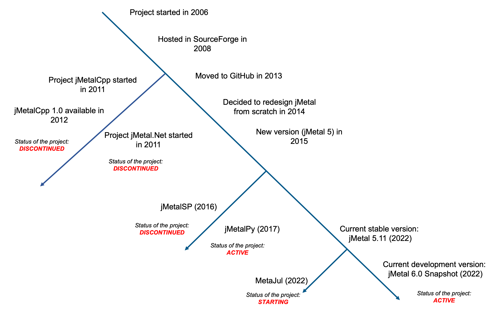

About jMetal
============
jMetal is a Java-based framework for multi-objective optimisation with metaheuristics, designed and
developed by computer science engineers for their own use in research in this area. The origin
of the tool was motivated by our interest in working on multi-objective optimization about 20 years
ago; in particular, we wanted to apply our background in parallelism to multi-objective metaheuristics.
In that time, the available software tools were the implementation of NSGA-II in C and the PISA
framework, also in C. On examination, we were not comfortable with the available source codes;
they lacked an object-oriented design and, in general, we found it difficult to read and understand
them. What we needed was an easy-to-use, flexible, extensible, and portable framework for our own
research. Our approach was to write our own framework from scratch for our research, resulting in jMetal.

The figure below summarises the chronology of jMetal releases over time, including related projects:

  Timeline of the development of jMetal and related projects.

The evolving of jMetal has been mainly addressed by major design changes related to the architecture
of the project. The first public version was described in the paper
`jMetal: A Java framework for multi-objective optimization <https://doi.org/10.1016/j.advengsoft.2011.05.014>`_,
published in 2011.
