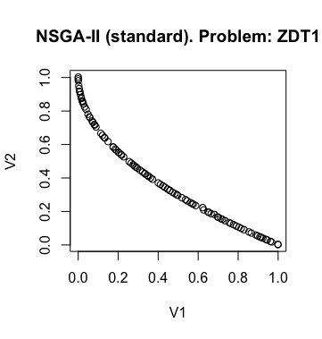
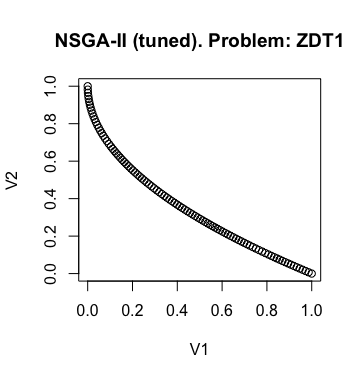
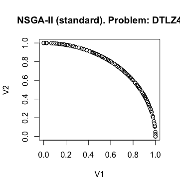
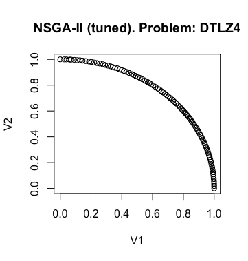
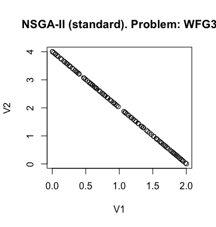
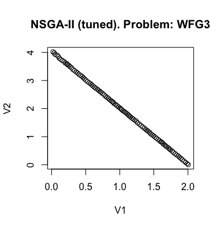

.. _autoconfiguration:

Auto-configuration of evolutionary algorithms: NSGA-II
======================================================

Before reading this section, readers are referred to the paper "Automatic configuration of NSGA-II with jMetal and irace", presented in GECCO 2019 (DOI: https://doi.org/10.1145/3319619.3326832), and to the :ref:`installation`. This tutorial is intended as a guide to replicate the experimentation conducted in that paper. Please, take into account that this is a work in progress, based on the new major version of jMetal (v6.0) which is in development. Comments, suggestions, and bugs reporting are welcome.

Motivation
----------
A current trend in multi-objective optimization is to use automatic parameter configuration tools to find accurate settings of metaheuristics to effectively solve a number of problems. The idea is to avoid the traditional approach of carrying out a number of pilot tests, which are typically conducted without following a systematic strategy. In this context, an algorithm configuration is a complete assignment of values to all required parameters of the algorithm.

The auto-configuration tool we have selected is irace, an R package that implements an
elitist iterated racing algorithm, where algorithm configurations
are sampled from a sampling distribution, uniformly at random at the beginning, but biased towards the best configurations found in later iterations. At each iteration, the generated configurations and
the "elite" ones from previous iterations are raced by evaluating
them on training problem instances. A statistical test is used to
decide which configurations should be eliminated from the race.
When the race terminates, the surviving configurations become
elites for the next iteration.

The issue we studied in the aforementioned paper is how to use jMetal combined with irace to allow the automatic configuration of multiobjective metaheuristics. As this is our first approximation to this matter, we decided to focus on NSGA-II and its use to solve continuous problems.

NSGA-II parameters
------------------
The standard NSGA-II is a generational evolutionary algorithm featured by using a ranking method based on Pareto ranking and the crowding distance density estimator, both in the selection and replacement steps.
When it is used to solve continuous problems, NSGA-II adopts the
simulated binary crossover (SBX) and the polynomial mutation. No
external archive is included in NSGA-II.
However, as we intend to configure NSGA-II in an automatic
way, we need to relax the aforementioned features in order to have
enough flexibility to modify the search capabilities of the algorithm.
This way, we are going to consider that any multi-objective evolutionary
algorithm with the typical parameters (selection, crossover,
and mutation) and using ranking and crowding in the replacement
step can be considered as a variant of NSGA-II.

The parameters or components of NSGA-II that can be adjusted are included in this table:

+---------------------------------------+-----------------------------------------------------+
| Parameter name                        | Allowed values                                      |
+=======================================+=====================================================+
| *algorithmResult*                     | *externalArchive*, *population*                     |
+---------------------------------------+-----------------------------------------------------+
| *populationSize*                      | 100                                                 |
+---------------------------------------+-----------------------------------------------------+
| *populationSizeWithArchive*           | 10,20,50,100,200,400                                |
+---------------------------------------+-----------------------------------------------------+
| *offspringPopulationSize*             | 1,5,10,20,50,100,200,400                            |
+---------------------------------------+-----------------------------------------------------+
| *createInitialSolutions*              | *random*, *latinHypercubeSampling*, *scatterSearch* |
+---------------------------------------+-----------------------------------------------------+
| *variation*                           | *crossoverAndMutationVariation*                     |
+---------------------------------------+-----------------------------------------------------+
| *crossover*                           | *SBX*, *BLX_Alpha*                                  |
+---------------------------------------+-----------------------------------------------------+
| *crossoverProbability*                | [0.0, 1.0]                                          |
+---------------------------------------+-----------------------------------------------------+
| *crossoverRepairStrategy*             | *random*, *round*, *bounds*                         |
+---------------------------------------+-----------------------------------------------------+
| *sbxCrossoverDistributionIndex*       | [5.0, 400.0]                                        |
+---------------------------------------+-----------------------------------------------------+
| *blxAlphaCrossoverAlphaValue*         | [0.0, 1.0]                                          |
+---------------------------------------+-----------------------------------------------------+
| *mutation*                            | *uniform*, *polynomial*                             |
+---------------------------------------+-----------------------------------------------------+
| *mutationProbability*                 | [0.0, 1.0]                                          |
+---------------------------------------+-----------------------------------------------------+
| *mutationRepairStrategy*              | *random*, *round*, *bounds*                         |
+---------------------------------------+-----------------------------------------------------+
| *polynomialMutationDistributionIndex* | [5.0, 400.0]                                        |
+---------------------------------------+-----------------------------------------------------+
| *uniformMutationPerturbation*         | [0.0, 1.0]                                          |
+---------------------------------------+-----------------------------------------------------+
| *selection*                           | *random*, *tournament*                              |
+---------------------------------------+-----------------------------------------------------+
| *selectionTournamentSize*             | [2, 10]                                             |
+---------------------------------------+-----------------------------------------------------+

Our *autoNSGAII* can optionally adopt an external archive to store the non-dominated solutions found during the search process. The archive size of bounded and the crowding distance estimator is used to remove solutions with the archive is full. Then, in case of using no archive, the result of the algorithm is the population, which is configured with the *populationSize* parameter; otherwise, the output is the external archive, whose maximum size is *populationSize* parameter value, but then the population size can be tuned by taking values from the set (10, 20, 50, 100, 200, 400).

In the classical NSGA-II, the offspring population size is equal to the population size, but we can set its value from 1 (which leads to a steady-state selection scheme) to 400.

The initial population is typically filled with randomly created solutions, but we also allows to use a latin hypercube sampling scheme and a strategy similar to the one used in the scatter search algorithm.

The *autoNSGAII* has a *variation* component than can take a single value named *crossoverAndMutationVariation*. It is intended to represent the typical crossover and mutation operators of a genetic algorithm (additional values, e.g., *DifferentialiEvolutionVariation* are expected to be added in the future). The *crossover* operators included are *SBX* (simulated binary crossover) and *BLX_Alpha*, which are featured by a given probability and a *crossoverRepairStrategy*, which defines what to do when the crossover produces a variable value out of the allowed bounds (please, refer to Section 3.2 and Figure 3 in the paper). The *SBX* and *BLX_Alpha* require, if selected, a distribution index (a value in the range [5.0, 400]) and an alpha value (in the range [0.0, 1.0]), respectively. Similarly, there are two possible mutation operators to choose from, *polynomial* and *uniform*, requiring both a mutation probability and a repairing strategy; the polynomial mutation has, as the SBX crossover, a distribution index parameter (in the range [5.0, 400]) and the *uniform* mutation needs a perturbation value (in the range [0.0, 1.0]).

Finally, the *selection* operator be *random* or *tournament*; this last one can take a value between 2 (i.e., binary tournament) and 10.

As we intend to use irace as auto-tuning package, it requires a text file containing information about the parameters, the values they can take, an their relationships. We have created then a file called ``parameters-NSGAII.txt`` containing the required data::

  algorithmResult                          "--algorithmResult "                     c       (externalArchive,population)
  populationSize                           "--populationSize "                      o       (100)
  populationSizeWithArchive                "--populationSizeWithArchive "           o       (10,20,50,100,200)         | algorithmResult %in% c("externalArchive")
  #
  maximumNumberOfEvaluations               "--maximumNumberOfEvaluations "          c       (25000)
  createInitialSolutions                   "--createInitialSolutions "              c       (random,latinHypercubeSampling,scatterSearch)
  #
  variation                                "--variation "                           c       (crossoverAndMutationVariation)
  offspringPopulationSize                  "--offspringPopulationSize "             o       (1,10,50,100)
  crossover                                "--crossover "                           c       (SBX,BLX_ALPHA)
  crossoverProbability                     "--crossoverProbability "                r       (0.0, 1.0)                     | crossover %in% c("SBX","BLX_ALPHA")
  crossoverRepairStrategy                  "--crossoverRepairStrategy "             c       (random, round, bounds)        | crossover %in% c("SBX","BLX_ALPHA")
  sbxDistributionIndex                     "--sbxDistributionIndex "                r       (5.0, 400.0)                   | crossover %in% c("SBX")
  blxAlphaCrossoverAlphaValue              "--blxAlphaCrossoverAlphaValue "         r       (0.0, 1.0)                     | crossover %in% c("BLX_ALPHA")
  mutation                                 "--mutation "                            c       (uniform, polynomial)
  mutationProbability                      "--mutationProbability "                 r       (0.0, 1.0)                     | mutation %in% c("uniform","polynomial")
  mutationRepairStrategy                   "--mutationRepairStrategy "              c       (random, round, bounds)        | mutation %in% c("uniform","polynomial")
  polynomialMutationDistributionIndex      "--polynomialMutationDistributionIndex " r       (5.0, 400.0)                   | mutation %in% c("polynomial")
  uniformMutationPerturbation              "--uniformMutationPerturbation "         r       (0.0, 1.0)                     | mutation %in% c("uniform")
  #
  selection                                "--selection "                           c       (tournament, random)
  selectionTournamentSize                  "--selectionTournamentSize "             i       (2, 10)                        | selection %in% c("tournament")
  #

To know about the syntax of irace configuration files, please refer to the irace documentation.

The ``EvolutionaryAlgorithm`` class
-----------------------------------
Once we have defined the parameters of NSGA-II that can be tuned, the next issue to deal with is to have an implementation of the algorithm that can be configured with any valid combination of parameter values. The implementation of NSGA-II provided by jMetal is based on inheritance from the ``AbstractEvolutionaryAlgorithm`` class, so adapting it for auto-configuration is not a simple task, so our decision has been to create a new Maven subproject, called ``jmetal-auto`` from scratch and include in it all the classes related to the auto-configuration of metaheuristics. This way we do not interfere in the existing code, but with the disadvantage that we are going to have duplications of some functionalities. In particular,

The following code snippet include the most relevant parts of the ``EvolutionaryAlgorithm`` class, which is the algorithm template we have defined for developing autoconfigurable metaheuristics. It is not an abstract but a regular class containing the basic components of an evolutionary algorithm, including the selection, variation and replacement steps.

.. code-block:: java

  package org.uma.jmetal.auto.algorithm;
  ...
  public class EvolutionaryAlgorithm<S extends Solution<?>>{
    ...
    public EvolutionaryAlgorithm(
      String name,
      Evaluation<S> evaluation,
      InitialSolutionsCreation<S> initialPopulationCreation,
      Termination termination,
      MatingPoolSelection<S> selection,
      Variation<S> variation,
      Replacement<S> replacement,
      Archive<S> externalArchive) {
      ...
   }

    public void run() {
      population = createInitialPopulation.create();
      population = evaluation.evaluate(population);
      initProgress();
      while (!termination.isMet(attributes)) {
        List<S> matingPopulation = selection.select(population);
        List<S> offspringPopulation = variation.variate(population, matingPopulation);
        offspringPopulation = evaluation.evaluate(offspringPopulation);
        updateArchive(offspringPopulation);

        population = replacement.replace(population, offspringPopulation);
        updateProgress();
      }
    }

    private void updateArchive(List<S> population) {
      if (externalArchive != null) {
        for (S solution : population) {
          externalArchive.add(solution);
        }
      }
    }

    ...

    @Override
    public List<S> getResult() {
      if (externalArchive != null) {
        return externalArchive.getSolutionList();
      } else {
        return population;
      }
    }
  }

To configure NSGA-II, we have developed a package ``org.uma.jmetal.auto.component`` which provides components that can be used with the ``EvolutionaryAlgorithm`` class. Each component has an interface and a number of implementations. It is worth mentioning that two of the components, ``evaluation`` and ``termination``, will not typically be used in the auto-configuration of the algorithm, but the ``termination`` is particularly interesting because it allows to define different stopping conditions: by number of evaluations, by computing time, and when the user presses a key.

The ``AutoNSGAII`` class
------------------------
An example of configuring and running NSGA-II with these ``EvolutionaryAlgorithm`` class is provided in ``org.uma.jmetal.auto.algorithm.nsgaii.NSGAII``, where that class is instantiated with the components leading to an standard NSGA-II. However, our purpose is to have the ability of automatically configure NSGA-II, so we need something more flexible.

The approach we have adopted is to get a sequence of pairs <parameter, value> as input, which is parsed to properly get a version of NSGA-II. This task is performed by class ``org.uma.jmetal.auto.algorithm.nsgaii.AutoNSGAII``. This way, to get an NSGA-II algorithm with standard settings the following string must be passed to class ``AutoNSGAII`` from the command line:

.. code-block:: text

                --problemName org.uma.jmetal.problem.multiobjective.zdt.ZDT1 "
                + "--referenceFrontFileName ZDT1.pf "
                + "--maximumNumberOfEvaluations 25000 "
                + "--algorithmResult population "
                + "--populationSize 100 "
                + "--offspringPopulationSize 100 "
                + "--createInitialSolutions random "
                + "--variation crossoverAndMutationVariation "
                + "--selection tournament "
                + "--selectionTournamentSize 2 "
                + "--rankingForSelection dominanceRanking "
                + "--densityEstimatorForSelection crowdingDistance "
                + "--crossover SBX "
                + "--crossoverProbability 0.9 "
                + "--crossoverRepairStrategy bounds "
                + "--sbxDistributionIndex 20.0 "
                + "--mutation polynomial "
                + "--mutationProbability 0.01 "
                + "--mutationRepairStrategy bounds "
                + "--polynomialMutationDistributionIndex 20.0 "

We include a class named ``org.uma.jmetal.auto.algorithm.nsgaii.NSGAWithParameters" showing how to use this parameter string with ``AutoNSGAII``.

Stuff required
--------------

To replicate the results presented in https://doi.org/10.1145/3319619.3326832 we need:

* R
* The jar file `jmetal-auto-6.0-SNAPSHOT-jar-with-dependencies.jar`.
* The contents of folder ``jmetal-auto/src/main/resources/irace``.

To generate the `jmetal-auto-6.0-SNAPSHOT-jar-with-dependencies.jar` file, just type the following command at the root of the jMetal project:

.. code-block:: bash

  mvn clean package -DskipTests=tournament

If everything goes fine, the file will be generated in the `jmetal-auto/target` folder.

The contents of irace folder are the following:

1. ``irace.tar.gz``: file containing irace
2. ``parameters-NSGAII.txt``: file describing the parameters that can be tuned, including their allowed values and their dependences. You are free to modify some parameter values if you know their meaning.
3. ``instances-list.txt``: the problems to be solved and their reference Pareto fronts are included here. It currently contains the following:

.. code-block:: text

  org.uma.jmetal.problem.multiobjective.wfg.WFG1 --referenceFrontFileName WFG1.2D.pf
  org.uma.jmetal.problem.multiobjective.wfg.WFG2 --referenceFrontFileName WFG2.2D.pf
  org.uma.jmetal.problem.multiobjective.wfg.WFG3 --referenceFrontFileName WFG3.2D.pf
  org.uma.jmetal.problem.multiobjective.wfg.WFG4 --referenceFrontFileName WFG4.2D.pf
  org.uma.jmetal.problem.multiobjective.wfg.WFG5 --referenceFrontFileName WFG5.2D.pf
  org.uma.jmetal.problem.multiobjective.wfg.WFG6 --referenceFrontFileName WFG6.2D.pf
  org.uma.jmetal.problem.multiobjective.wfg.WFG7 --referenceFrontFileName WFG7.2D.pf
  org.uma.jmetal.problem.multiobjective.wfg.WFG8 --referenceFrontFileName WFG8.2D.pf
  org.uma.jmetal.problem.multiobjective.wfg.WFG9 --referenceFrontFileName WFG9.2D.pf

We must note that **currently we can only auto-configure NSGA-II with benchmark problems** included in jMetal.

4. ``scenario-NSGAII.txt``: default irace parameters (we usually keep this file unchanged)
5. ``target-runner``. Bash script which is executed in every run of irace.
6. ``run.sh``. Bash script to run irace. VERY IMPORTANT: the number of cores to be used by irace are indicated in the ``IRACE_PARAMS`` variable (the default value is 24).

Running everything
------------------

Once you have all the needed resources, just create a folder in the machine where you are going to run the experiment and copy  the contents of the `irace` folder and the `jmetal-auto-6.0-SNAPSHOT-jar-with-dependencies.jar` file into it. Take into account that irace will generate thousands of configurations, so using a multi-core machine is advisable (we use a Linux virtual machine with 24 cores). We have tested the software in Linux, macOS, and Windows 10 (in the Ubuntu Bash console).

To run irace simply run the following command:

.. code-block:: bash

  ./run.sh NSGAII 3

The last parameter is used as a seed.

Results
-------

irace will create a directory called ``execdir`` where it will write a number of output files. Two of those files are of particular interest: ``irace.stderr.out`` and ``irace.sdtout.out``. The first file should be empty, i.e., we should get an empty line are executing this command:

.. code-block:: bash

  cat execdir/irace.stdout.out

The second file contains a lot of information about the run of irace, including the configurations being tested. We are particularly interested in the best found configurations, which are written at the end of the file (just below the line starting by "# Best configuration as command lines"). For example, a result is the following:

.. code-block:: text

  # Best configurations as commandlines (first number is the configuration ID; same order as above):
  4646  --algorithmResult externalArchive --populationSize 100 --populationSizeWithArchive 20 --maximumNumberOfEvaluations 25000 --createInitialSolutions random --variation crossoverAndMutationVariation --offspringPopulationSize 1 --crossover BLX_ALPHA --crossoverProbability 0.876 --crossoverRepairStrategy random --blxAlphaCrossoverAlphaValue 0.5729 --mutation uniform --mutationProbability 0.0439 --mutationRepairStrategy bounds --uniformMutationPerturbation 0.9957 --selection tournament --selectionTournamentSize 8

This configuration can be used with the ``NSGAWithParameters`` program to run NSGA-II with those settings.

Some examples of Pareto front approximations produced with NSGA-II with standard settings and with the tuned configuration are included next:

