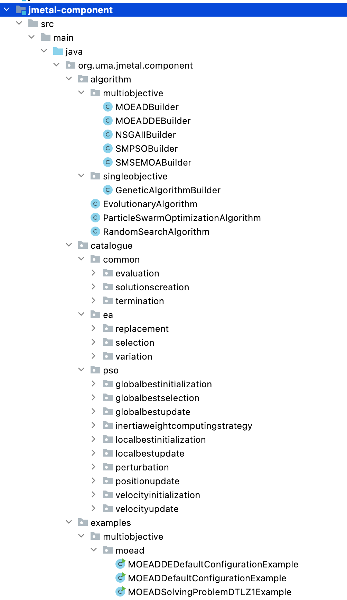
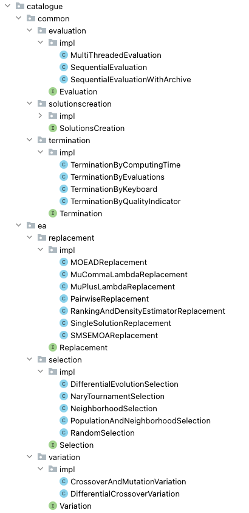

.. _component:

Component-based algorithms
==========================

:Author: Antonio J. Nebro
:Version: 1.0
:Date: 2022-7-11

The design and architecture of the metaheuristics included in jMetal is probably the feature that has evolved
the most since the start of the project in 2006. In first versions, the implementation of a metaheuristic required
to implement an `Algorithmn` abstract class, which had an `execute()` abstract method that had to be implemented by any
algorithm. As a consequence, developers were free to write the code of an algorithm without any constraint,
resulting in many cases in codes that were difficult to extend and to reuse. To give an example, the
`execute()` code of our implementation of NSGA-II was about 130 lines long, and the development of a
steady-state version of NSGA-II was made by copying all of that code and modifying a few lines from de original
code. This architecture was described in the paper `jMetal: A Java framework for multi-objective
optimization <https://doi.org/10.1016/j.advengsoft.2011.05.014>`_, published in Advanced in Engineering Software
in 2011, and it was used until jMetal version 4.5.

We took the decision of redesigning jMetal from scratch in 2014, leading to jMetal 5.0 a year later.
The main features of that version were presented in the EvoSoft of the GECCO conference in 2015 (
`Redesigning the jMetal Multi-Objective Optimization Framework <https://doi.org/10.1145/2739482.2768462>`_),
including the inclusion of algorithm templates for metaheuristics such as evolutionary algorithms
and particle swarm optimization techniques. In this way, code reuse was significantly improved but
at the cost of having to take into account the use of templates,
which has proved cumbersome for some researchers, and the consequence is that there are still people
using jMetal 4.5.

Now, in the incoming major release of jMetal (version 6.0), we propose a new architecture for the
design and implementation of metaheuristics. The main reason has to do with the fact that we are
currently interested in using jMetal for the auto-configuration and auto-design of algorithms,
and the current architecture has limitations for this, as discussed in the paper
`Automatic Configuration of NSGA-II with jMetal and irace (GECCO Companion 2019) <https://doi.org/10.1145/3319619.3326832>`_.
The idea is to use a component-based approach, were algorithmic templates are again used but
the steps of the algorithms are implemented as objects instead of methods so, instead of using inheritance,
implementing a given algorithm requires to add the proper components to the template. The resulting
architecture allow metaheuristics to be highly configurable without the need of defining sub-clases .
Furthermore, the templates are observable entities, according to the Observer pattern, so observers entities
can register into them and be notified when the state of the algorithm changes (e.g., a real chart observer
can receive the population after each algorithm interation to plot it).

Contrarily to the approach adopted in jMetal 5.0, in jMetal 6.0 the new architecture is not going
to replace the former one. There are some reasons for this, starting with the aforementioned comment about
jMetal users who are comfortable with the current implementation and are probably not interested
in learning another way of developing or using the algorithms. Another reason is that algorithms
having tightly related components can be difficult to be implemented with the component-
based architecture; this way, while NSGA-II adapts very well to the architecture, to implement MOEA/D
we had to design some complex components. As a consequence, all the component-related stuff is
located in a new Maven sub-project called `jmetal-component`.

The structure of the `jmetal-component` is depicted in this figure:

The main packages of the sub-project are the following:

* `algorithm`: Contains the algorithmic templates (such as `EvolutionaryAlgorithm` and `ParticleSwarmOptimization`) as well as builder classes to instantiate single- and multi-objective metaheuristics from them.

* `catalogue`: The components are included in a catalogue that is structured into three sub-packages:

  - `common`: Components that can be part of any algorithm.

  - `ea`: Specific components for evolutionary algorithms.

  - `pso`: Specific components of particle swarm optimization techniques.

* `examples`: Contains plenty of examples of how to use the templates to configure, create, and execute algorithms.

The `EvolutionaryComputation` template
^^^^^^^^^^^^^^^^^^^^^^^^^^^^^^^^^^^^^^
The component-based template for evolutionary algorithms is implemented in the `org.uma.jmetal.component.algorithm.EvolutionaryComputation` class. The following code snippet shows its state variables, which include the evolutionary components (create the initial population, evaluation, selection, variation, replacement, and termination) and the attributes map (containing
the information that will be notified to observers):

.. code-block:: java

  package org.uma.jmetal.solution;

  public class EvolutionaryAlgorithm<S extends Solution<?>>
    implements Algorithm<List<S>>, ObservableEntity<Map<String, Object>> {

    private List<S> population;
  
    private final Evaluation<S> evaluation;
    private final SolutionsCreation<S> createInitialPopulation;
    private final Termination termination;
    private final Selection<S> selection;
    private final Variation<S> variation;
    private final Replacement<S> replacement;
  
    private final Map<String, Object> attributes;
  
    private long initTime;
    private long totalComputingTime;
    private int evaluations;
  
    private final Observable<Map<String, Object>> observable;

  ...

The `run()` method of the class carries out the steps of a generic evolutionary algorithm:

.. code-block:: java

  public void run() {
    initTime = System.currentTimeMillis();

    population = createInitialPopulation.create();
    population = evaluation.evaluate(population);
    initProgress();
    while (!termination.isMet(attributes)) {
      List<S> matingPopulation = selection.select(population);
      List<S> offspringPopulation = variation.variate(population, matingPopulation);
      offspringPopulation = evaluation.evaluate(offspringPopulation);

      population = replacement.replace(population, offspringPopulation);
      updateProgress();
    }

    totalComputingTime = System.currentTimeMillis() - initTime;
  }

The state of the algorithm is updated with methods `initProgress()`  and `updateProgress`:

.. code-block:: java

  protected void initProgress() {
    evaluations = population.size();

    attributes.put("EVALUATIONS", evaluations);
    attributes.put("POPULATION", population);
    attributes.put("COMPUTING_TIME", getCurrentComputingTime());
  }

  protected void updateProgress() {
    evaluations += variation.getOffspringPopulationSize();

    attributes.put("EVALUATIONS", evaluations);
    attributes.put("POPULATION", population);
    attributes.put("COMPUTING_TIME", getCurrentComputingTime());

    observable.setChanged();
    observable.notifyObservers(attributes);

    totalComputingTime = getCurrentComputingTime();
  }

As it can be observed, the `initProgress()` method initializes the evaluation counter and sets three attributes: evaluations,
population, and computing time. The `updateProgress()` method is invoked at the end of each iteration and, besides updating the same elements as `initProgress()`, notify observers the new attribute values. 

Configuring a particular evolutionary algorithm with the `EvolutionaryAlgorithm` class merely requires to instantiate it the proper components. To facilitate this task, we provide builder classes that allows to get algorithms configured with default settings and facilitates to indicate particular parameter values. Let us consider the NSGA-II algorithm; the constructor of the `NSGAIIBuilder`
class is the following one:

.. code-block:: java

  public NSGAIIBuilder(Problem<S> problem, int populationSize, int offspringPopulationSize,
      CrossoverOperator<S> crossover, MutationOperator<S> mutation) {
    name = "NSGAII";

    densityEstimator = new CrowdingDistanceDensityEstimator<>();
    ranking = new FastNonDominatedSortRanking<>();

    this.createInitialPopulation = new RandomSolutionsCreation<>(problem, populationSize);

    this.replacement =
        new RankingAndDensityEstimatorReplacement<>(
            ranking, densityEstimator, Replacement.RemovalPolicy.oneShot);

    this.variation =
        new CrossoverAndMutationVariation<>(
            offspringPopulationSize, crossover, mutation);

    int tournamentSize = 2 ;
    this.selection =
        new NaryTournamentSelection<>(
            tournamentSize,
            variation.getMatingPoolSize(),
            new MultiComparator<>(
                Arrays.asList(
                    Comparator.comparing(ranking::getRank),
                    Comparator.comparing(densityEstimator::getValue).reversed())));

    this.termination = new TerminationByEvaluations(25000);

    this.evaluation = new SequentialEvaluation<>(problem);
  }

We provide many examples of using this class to configure NSGA-II (included the `org.uma.jmetal.component.examples.multiobjective.nsgaii` package). Some of them are:

* `NSGAIIDefaultConfigurationExample`: NSGA-II configured with default settings to solve a continuous problem.
* `NSGAIISteadyStateExample`: The same as the former example, but configuring a steady-state version of the NSGA-II
* `ParallelNSGAIIExample`: NSGA-II with a multi-threaded evaluator
* `NSGAIIStoppingByHypervolume.java`: NSGA-II using a terminator to stop the computation when the hypervolume of the current population achieves a particular value.

The `ParticleSwarmOptimizationAlgorithm` template
^^^^^^^^^^^^^^^^^^^^^^^^^^^^^^^^^^^^^^^^^^^^^^^^^
Following the same methodology for designing a component-based template for evolutionary computation, we have designed and implemented a `ParticleSwarmOptimizationAlgorithm` class. This template was used in the paper "Automatic Design of Multi-Objective Particle Swarm Optimizers", accepted in the ANTs 2022 conference.

Its `run()` method is included in this code snippet:

.. code-block:: java

  public void run() {
    initTime = System.currentTimeMillis();

    swarm = createInitialSwarm.create();
    swarm = evaluation.evaluate(swarm);
    speed = velocityInitialization.initialize(swarm);
    localBest = localBestInitialization.initialize(swarm);
    globalBest = globalBestInitialization.initialize(swarm, globalBest);

    initProgress();
    while (!termination.isMet(attributes)) {
      velocityUpdate.update(swarm, speed, localBest, globalBest, globalBestSelection,
          inertiaWeightComputingStrategy);
      positionUpdate.update(swarm, speed);
      swarm = perturbation.perturb(swarm);
      swarm = evaluation.evaluate(swarm);
      globalBest = globalBestUpdate.update(swarm, globalBest);
      localBest = localBestUpdate.update(swarm, localBest);
      updateProgress();
    }

We can observe the specific steps of a generic PSO algorithm, and the use of common components used algo in the `EvolutionaryAlgorithm` class, such as `evaluation` and `termination`. In its current state, this class is intended to be used
in the context of multi-objective optimization, so it assumes that an external archvive is used to store the leaders found during
the search.

The `Component` catalogue
^^^^^^^^^^^^^^^^^^^^^^^^^
The key of having a component-based architecture is to provide a catalogue of components to allow to generate a number of different algorithms by selecting and combining particular components in some way. The following picture shows the current components included in the `common` and `ea` packages:

Each component type is included in a package containing an interface with the component name and an `impl` 
sub-package where all the implementations of the interface are stored. For example, the `Termination` interface for termination components is as follows:

.. code-block:: java

  package org.uma.jmetal.component.catalogue.common.termination;

  import java.util.Map;

  /**
   * This interface represents classes that isMet the termination condition of an algorithm.
   *
   * @author Antonio J. Nebro <antonio@lcc.uma.es>
   */
  @FunctionalInterface
  public interface Termination {
    boolean isMet(Map<String, Object> algorithmStatusData) ;
  }

This interface has a method called `isMet()` that returns true whenever the implemented stopping condition is met. For example, the `TerminationByEvaluations` class defines that method as shown here:

.. code-block:: java 

  package org.uma.jmetal.component.catalogue.common.termination.impl;

  /**
   * Class that allows to check the termination condition based on a maximum number of indicated
   * evaluations.
   *
   *  @author Antonio J. Nebro <antonio@lcc.uma.es>
   */
  public class TerminationByEvaluations implements Termination {
    private final int maximumNumberOfEvaluations ;

    public TerminationByEvaluations(int maximumNumberOfEvaluations) {
      this.maximumNumberOfEvaluations = maximumNumberOfEvaluations ;
    }

    @Override
    public boolean isMet(Map<String, Object> algorithmStatusData) {
      int currentNumberOfEvaluations = (int) algorithmStatusData.get("EVALUATIONS") ;

      return (currentNumberOfEvaluations >= maximumNumberOfEvaluations) ;
    } 
  }

The point is that this class has access to the attribute field of the algorithms using it, so it have access to the current number of evaluations. Other implementations of `Termination` allow to stop when a given computing time has been expired, when a keyboard key is pressed, or when the quality indicator value of the current population exceeds a given threshold.