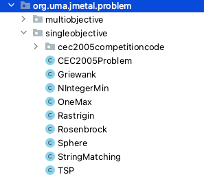
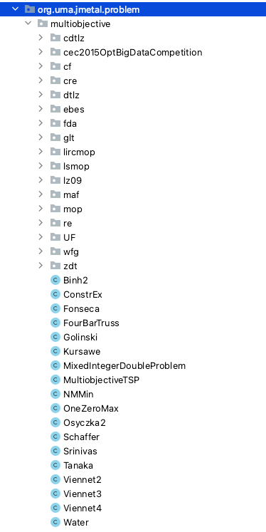

.. _problems:

Optimization Problems
=====================

:Author: Antonio J. Nebro
:Date: 2021-11-17

All the problems in jMetal implement the `Problem <https://github.com/jMetal/jMetal/blob/master/jmetal-core/src/main/java/org/uma/jmetal/problem/Problem.java>`_ interface:

.. code-block:: java

    package org.uma.jmetal.problem;

    /**
     * Interface representing a multi-objective optimization problem
     *
     * @author Antonio J. Nebro <antonio@lcc.uma.es>
     *
     * @param <S> Encoding
     */
    public interface Problem<S> extends Serializable {
      /* Getters */
      int getNumberOfVariables() ;
      int objectives().length ;
      int getNumberOfConstraints() ;
      String getName() ;

      /* Methods */
      void evaluate(S solution) ;
      S createSolution() ;
    }

Every problem is characterized by the number of decision variables, the number of objective functions and the number of constraints, so getter methods for returning those values have to be defined. The genetic type `S` allows to determine the encoding of the solutions of the problem. This way, a problem must include a method for evaluating any solution of class `S` as well as providing a `createSolution()` method for creating a new solution. A class named 
`AbstractGenericProblem <https://github.com/jMetal/jMetal/blob/master/jmetal-core/src/main/java/org/uma/jmetal/problem/AbstractGenericProblem.java>`_ containing setter and getter method implementations for the problem fields is provided.

If a problem has side constraints, it is assumed that the overall constraint degree of a given solution is computed inside the `evaluate()` method.

jMetal provides currently the following interfaces representing types of problems (all of them extending `Problem`), and the available implementations of them:

* `BinaryProblem <https://github.com/jMetal/jMetal/tree/master/jmetal-core/src/main/java/org/uma/jmetal/problem/binaryproblem/BinaryProblem.java>`_

    * `AbstractBinaryProblem <https://github.com/jMetal/jMetal/blob/master/jmetal-core/src/main/java/org/uma/jmetal/problem/binaryproblem/impl/AbstractBinaryProblem.java>`_: Each problem variable is a bit string, and the class includes methods such as `getBitsFromVariable(int index)` and `getTotalNumberOfBits()`.

* `IntegerProblem <https://github.com/jMetal/jMetal/tree/master/jmetal-core/src/main/java/org/uma/jmetal/problem/integerproblem/IntegerProblem.java>`_

    * `AbstractIntegerProblem <https://github.com/jMetal/jMetal/blob/master/jmetal-core/src/main/java/org/uma/jmetal/problem/integerproblem/impl/AbstractIntegerProblem.java>`_: The problem variables are integer values in a given range defined by a lower and upperbound. This means that this class is not adequate for combinatorial problems based on integer values.

* `DoubleProblem <https://github.com/jMetal/jMetal/blob/master/jmetal-core/src/main/java/org/uma/jmetal/problem/doubleproblem/DoubleProblem.java>`_

    * `AbstractDoubleProblem <https://github.com/jMetal/jMetal/blob/master/jmetal-core/src/main/java/org/uma/jmetal/problem/doubleproblem/impl/AbstractDoubleProblem.java>`_: The problem variables are double values in a given range defined by a lower and upperbound.

    * `ComposableDoubleProblem <https://github.com/jMetal/jMetal/blob/master/jmetal-core/src/main/java/org/uma/jmetal/problem/doubleproblem/impl/ComposableDoubleProblem.java>`_: This class allows to define a double problem in a dynamic way, as shown in this code snippet:

    .. code-block:: java

      ComposableDoubleProblem problem = new ComposableDoubleProblem()
      .setName("Srinivas")
      .addVariable(-20.0, 20.0)
      .addVariable(-20.0, 20.0)
      .addFunction((x) -> 2.0 + (x[0] - 2.0) *  (x[0] - 2.0) + (x[1] - 1.0) * (x[1] - 1.0))
      .addFunction((x) -> 9.0 * x[0] - (x[1] - 1.0) * (x[1] - 1.0))
      .addConstraint((x) -> 1.0 - (x[0] * x[0] + x[1] * x[1]) / 225.0)
      .addConstraint((x) -> (3.0 * x[1] - x[0]) / 10.0 - 1.0)) ;

    * `DummyDoubleProblem <https://github.com/jMetal/jMetal/blob/master/jmetal-core/src/main/java/org/uma/jmetal/problem/doubleproblem/impl/DummyDoubleProblem.java>`_: This class is intended to be used in unit testing code (to avoid having to define it many times).

* `PermutationProblem <https://github.com/jMetal/jMetal/tree/master/jmetal-core/src/main/java/org/uma/jmetal/problem/permutationproblem/PermutationProblem.java>`_

    * `AbstractIntegerPermutationProblem <https://github.com/jMetal/jMetal/blob/master/jmetal-core/src/main/java/org/uma/jmetal/problem/permutationproblem/impl/AbstractIntegerPermutationProblem.java>`_: The problem variables are permutations of integer values.

* `SequenceProblem <https://github.com/jMetal/jMetal/tree/master/jmetal-core/src/main/java/org/uma/jmetal/problem/sequenceproblem/SequenceProblem.java>`_

    * `CharSequenceProblem <https://github.com/jMetal/jMetal/blob/master/jmetal-core/src/main/java/org/uma/jmetal/problem/sequenceproblem/impl/CharSequenceProblem.java>`_: The problem variables are sequences of chars.

The ``jmetal-problem`` subproject
---------------------------------

All the problems provided by jMetal are included in the ``org.uma.jmetal.problem`` package located in
the ``jmetal-problem`` subproject. The package includes the sub-packages ``multiobjective`` and
``singleobjective``, which contains the codes of the problems. You can find both individual
problems (e.g., *Kursawe*, *Sphere*, etc.) and benchmarks suites (such as *ZDT*, *DTLZ* or *LZ09*).

The lists of single- and multi-objective problems are included in the next figures:

Example of continuous problem: *Kursawe*
----------------------------------------

.. math::

    n_{\mathrm{offset}} = \sum_{k=0}^{N-1} s_k n_k