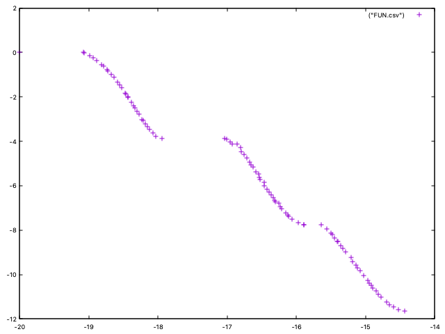

Quick Start
===========

Let us assume that we are interesting in using NSGA-II to optimize problem Kursawe, which has the
following formulation:

.. math::

    f_1(\vec{x}) = \sum_{i=1}^{n-1} (-10 exp(-0.2 \sqrt{x^2_i + x^2_{i+1}}))

.. math::

    f_2(\vec{x}) = \sum_{i=1}^{n} (|x_i|^{0.8} + 5 \sin x^3_i)

.. math::

    x_i \in [-5.0, 5.0]

.. math::

    n = 3

The problem has two objectives and three decision variables and its Pareto front is disconnected:

.. image:: resources/figures/Kursawe.png
   :scale: 50 %
   :align: center

The code to optimize this problem with NSGA-II can be found in class ``NSGAIIRunner`` (package
``org.uma.jmetal.algorithm.examples.multiobjective.nsgaii``, subproject ``jmetal-algorithm``). The first step it to create the problem:

.. code-block:: java

  public class NSGAIIRunner extends AbstractAlgorithmRunner {
    // Import code
    public static void main(String[] args) throws JMetalException, IOException {

      String problemName = "org.uma.jmetal.problem.multiobjective.Kursawe";
      Problem<DoubleSolution> problem = ProblemFactory.<DoubleSolution>loadProblem(problemName);

      // Alternatively:
      // Problem<DoubleSolution> problem = new Kursawe()

Then, the crossover, mutation and selection operators are created and configured:

.. code-block:: java

    double crossoverProbability = 0.9;
    double crossoverDistributionIndex = 20.0;
    CrossoverOperator<DoubleSolution> crossover = new SBXCrossover(crossoverProbability,
        crossoverDistributionIndex);

    double mutationProbability = 1.0 / problem.getNumberOfVariables();
    double mutationDistributionIndex = 20.0;
    MutationOperator<DoubleSolution> mutation = new PolynomialMutation(mutationProbability,
        mutationDistributionIndex);

    SelectionOperator<List<DoubleSolution>, DoubleSolution> selection = new BinaryTournamentSelection<>(
        new RankingAndCrowdingDistanceComparator<>());

After indicating the popultion size, the algorithm can be instantiated by using the ``NSGAIIBuilder`` class:

.. code-block:: java

    int populationSize = 100;
    NSGAII<DoubleSolution> algorithm =
        new NSGAIIBuilder<>(problem, crossover, mutation, populationSize)
            .setSelectionOperator(selection)
            .setMaxEvaluations(25000)
            .build();

The last step is to run NSGA-II, get the result and store the found solutions:

.. code-block:: java

    AlgorithmRunner algorithmRunner = new AlgorithmRunner.Executor(algorithm).execute();
    List<DoubleSolution> population = algorithm.getResult();
    printFinalSolutionSet(population);

By the default, the solutions (Pareto set approximation) and their corresponding function values (Pareto front approximation) are stored in two CSV files called ``VAR.csv`` and ``FUN.csv`` respectively. When plotting the ``FUN.csv``, the result should be similar to this plot:

